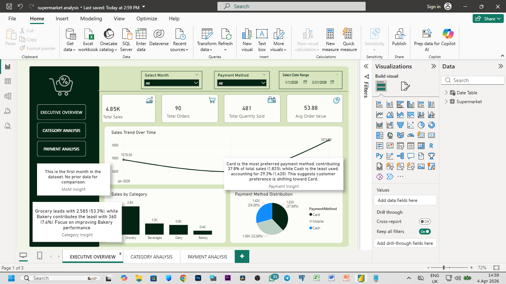
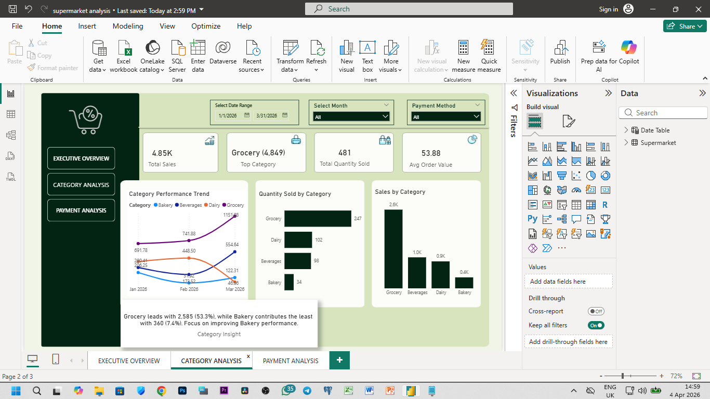
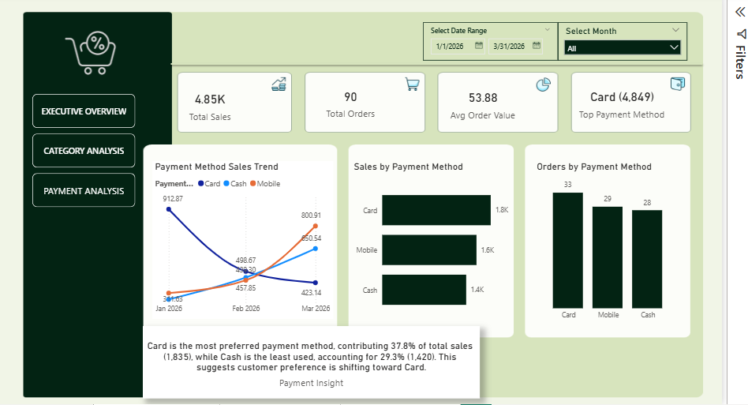

# 🛒 Supermarket-Sales-Analysis-Power-BI-Project-
End-to-end Power BI dashboard analyzing supermarket sales performance, category contribution, and payment trends using DAX and data modeling.

## 📊 Project Overview

This project presents an end-to-end data analysis solution for a supermarket business using Power BI. The dashboard delivers actionable insights into sales performance, customer purchasing behavior, product categories, and payment trends.

The goal of this project is to transform raw transactional data into meaningful insights that support data-driven decision-making.

## 🎯 Business Objectives

- Analyze overall sales performance over time
-Identify top-performing and underperforming product categories
- Understand customer payment preferences
- Track monthly growth and trends
- Provide actionable insights for business improvement

## 📌 Key Features

### Executive Overview Dashboard

- Total Sales, Total Orders, Total Quantity Sold, Avg Order Value (KPIs)
- Sales Trend Over Time (Monthly Analysis)
- Category Contribution Insight
- Payment Method Insight
- Dynamic Month-over-Month (MoM) Growth Insight

### Category Analysis Dashboard

- Sales by Category
- Quantity Sold by Category
- Category Performance Trend (Over Time)
- Top & Bottom Category Identification
- Category Contribution (%) Insight with recommendation

### Payment Analysis Dashboard

- Sales by Payment Method
- Payment Trend Over Time
- Payment Contribution (%)
- Most Preferred vs Least Used Payment Method Insight

## 📈 Key Insights

- 🟢 Identified top-performing category contributing the highest revenue
- 🔴 Highlighted underperforming category requiring improvement
- 📊 Revealed customer preference for specific payment methods
- 📉 Tracked monthly increase/decrease in sales performance
- 💡 Provided recommendations for improving low-performing areas

## 🧠 Skills & Concepts Applied

- Data Modeling (Star Schema)
- DAX (Data Analysis Expressions)
- Time Intelligence (MoM Growth, Previous Month Analysis)
- Dynamic Measures & KPIs
- Data Visualization & Dashboard Design
- Business Insight Generation
- User Experience (UX) Optimization in Power BI

## 🛠️ Tools Used

- Power BI
- DAX
- Microsoft Excel (for dataset preparation)

## 📥 Download Project File
Explore the full interactive dashboard:
👉 [Download Power BI File](pbix/supermarket-analysis.pbix)

## 📸 Dashboard Preview

### Executive Overview Dashboard

 

### 💡 Recommendations Base on Executive Overview Dashboard
- Stabilize revenue by replicating strategies from high-performing months and introducing consistent monthly promotions.
- Increase Average Order Value through product bundling and upselling techniques.
- Use dashboard insights for regular performance tracking and quick decision-making.
 

### Category Analysis Dashboard

 

### 💡 Recommendations Base on Category Analysis Dashboard
- Focus on expanding high-performing categories like Grocery to maximize revenue.
- Improve low-performing categories (e.g., Bakery) through discounts, repositioning, or cross-selling.
- Balance product mix to reduce over-dependence on a single category.
 

### Payment Analysis Dashboard

 

### 💡 Recommendations
- Promote digital payments (Card/Mobile) with incentives to improve efficiency.
- Reduce reliance on cash transactions to enhance operational control.
- Align payment strategies with customer preferences to improve checkout experience.

## 👤 Author

**Giwa Aaron Babatunde**  
📊 Data Analyst | Power BI Developer  
🚀 "Analyze With Giwa"  
🔗 GitHub: https://github.com/giwa-data-analyst

